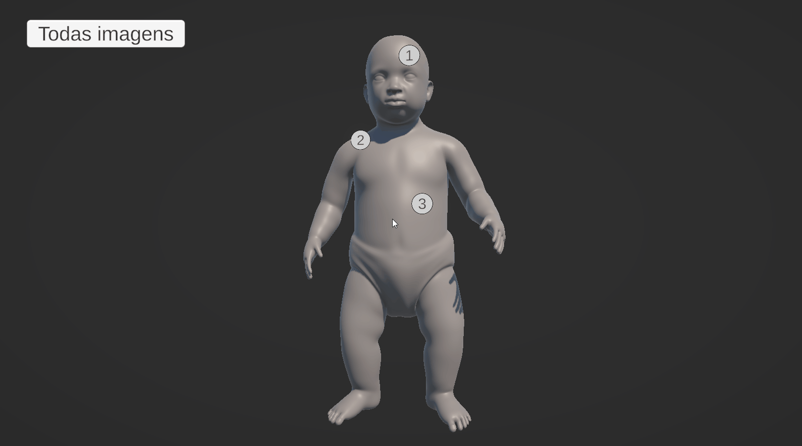

# Forensic-Damage-Visualizer

A forensic tool for visualizing injuries on a 3D human model. The application allows professionals to correlate photographic evidence with specific injuries, each mapped to a numbered location on the model for clarity and documentation.

## 📌 Features

- Interactive 3D human model
- Numbered injury markers


- Photo linking: each injury can display a related forensic photograph



- All photographs displays in a gallery


- Designed for forensic experts and legal documentation

## 📌 Tech Stack

- Unity 6 (6000.0.30f1)  
- C#  
- URP  
- GitHub

## 📦 Setup

```bash
git clone https://github.com/BrunoArn/Forensic-Injury-Visualizer.git
